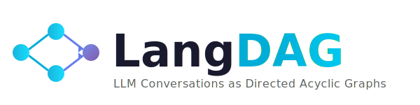

<p align="center">
  
</p>

<h3 align="center"><em>LLM Conversations as Directed Acyclic Graphs</em></h3>

<p align="center">
  <a href="https://github.com/yourusername/langdag/releases"></a>
  <a href="LICENSE"></a>
  <a href="https://golang.org/"></a>
</p>

<p align="center">
  <a href="#features">Features</a> •
  <a href="#installation">Installation</a> •
  <a href="#quick-start">Quick Start</a> •
  <a href="#documentation">Docs</a> •
  <a href="#roadmap">Roadmap</a>
</p>

---

## Why LangDAG?

LangDAG is a **high-performance Go tool** that models LLM conversations and workflows as directed acyclic graphs. Whether you're building chatbots, AI agents, or complex multi-step pipelines—LangDAG provides a unified, powerful abstraction.

```
┌─────────┐     ┌─────────┐     ┌─────────┐     ┌─────────┐
│  User   │────▶│   LLM   │────▶│  Tool   │────▶│   LLM   │
└─────────┘     └─────────┘     └─────────┘     └─────────┘
                    │                               │
                    └──────── conversation ─────────┘
                                 = DAG
```

**Key insight:** A conversation *is* a DAG—it just grows incrementally.

---

## Features

| Feature | Description |
|---------|-------------|
| 🔀 **Two Modes** | **Workflow** (YAML pipelines) + **Conversation** (dynamic chat) — same engine |
| ⚡ **Performance** | Pure Go, ~1ms overhead, single static binary, zero runtime deps |
| 🌊 **Native Streaming** | SSE + WebSocket support with tool call interruption |
| 🔧 **Tool Integration** | Auto, Interrupt, or WebSocket execution modes |
| 🌳 **Conversation Forking** | Branch from any node, explore alternative paths |
| 💾 **Persistent Storage** | SQLite (default) or PostgreSQL, full history replay |

---

## Installation

### From Source

```bash
git clone https://github.com/yourusername/langdag.git
cd langdag
go build -o langdag ./cmd/langdag
```

### Go Install

```bash
go install github.com/yourusername/langdag/cmd/langdag@latest
```

---

## Quick Start

### 1. Set up your API key

```bash
export ANTHROPIC_API_KEY="your-api-key"
```

### 2. Start chatting

```bash
langdag chat new
```

```
Starting new conversation (id: a1b2c3d4)

You> What is a DAG?
Assistant> A DAG (Directed Acyclic Graph) is a graph structure where edges
have a direction and there are no cycles...

You> /quit
```

### 3. List your conversations

```bash
langdag ls
```

```
ID        Title                 Source    Status     Model                    Created
a1b2c3d4  What is a DAG?        chat      active     claude-sonnet-4-2025...  2025-02-04 10:30
```

### 4. View conversation details

```bash
langdag show a1b2
```

```
DAG: a1b2c3d4-5e6f-7890-abcd-ef1234567890
Title: What is a DAG?
Source: chat
Status: active
Model: claude-sonnet-4-20250514
Created: 2025-02-04 10:30:00
Nodes: 2

Node history:
├─ 1a2b3c4d [human]: What is a DAG?
└─ 5e6f7890 [assistant]: A DAG (Directed Acyclic Graph) is a graph structure...
```

### 5. Continue or fork the conversation

```bash
# Continue from where you left off
langdag chat continue a1b2

# Or fork from a specific node to explore alternatives
langdag chat continue --node 1a2b3c4d
```

```
Continuing from node 1a2b3c4d
DAG: a1b2c3d4

You> Actually, explain it with a simple example
Assistant> Sure! Imagine a family tree...
```

### 6. See the branching structure

```bash
langdag show a1b2
```

```
Node history:
├─ 1a2b3c4d [human]: What is a DAG?
├─ 5e6f7890 [assistant]: A DAG (Directed Acyclic Graph) is...
 │└─ 7a8b9c0d [human]: Actually, explain it with a simple example
  └─ 0d1e2f34 [assistant]: Sure! Imagine a family tree...
```

Every conversation is a DAG that grows as you chat—and you can branch from any point.

---

## CLI Reference

### Chat Commands

```bash
langdag chat new                    # Start new conversation
langdag chat new --model <model>    # Use a specific model
langdag chat new --system "..."     # With system prompt
langdag chat continue <id>          # Continue conversation
langdag chat continue --node <id>   # Fork from specific node
```

### DAG Management

```bash
langdag ls                          # List all DAGs
langdag show <id>                   # Show DAG details and node tree
langdag rm <id>                     # Delete DAG
```

### Configuration

```bash
langdag config set <key> <value>    # Set config value
langdag config get <key>            # Get config value
```

---

## Workflows

For pre-defined pipelines, LangDAG supports YAML workflow definitions:

```yaml
# research.yaml
name: research_agent
description: Research a topic

defaults:
  model: claude-sonnet-4-20250514
  max_tokens: 4096

nodes:
  - id: input
    type: input
  - id: researcher
    type: llm
    system: "You are a research assistant."
    prompt: "Research this topic: {{input}}"
  - id: output
    type: output

edges:
  - from: input
    to: researcher
  - from: researcher
    to: output
```

```bash
# Create and run workflows
langdag workflow create research.yaml
langdag workflow run research --input '{"query": "quantum computing"}'

# Workflow management
langdag workflow list               # List workflows
langdag workflow run <name> --stream # With streaming
langdag workflow validate <file>    # Validate YAML
```

Workflows create DAGs that can be continued interactively using `langdag chat continue`.

---

## Use as API Server

LangDAG can run as a REST API server for integration with other applications:

```bash
langdag serve --port 8080
```

The API provides endpoints for all CLI functionality:

- `GET /dags` — List all DAGs
- `GET /dags/{id}` — Get DAG details
- `POST /chat` — Start new conversation
- `POST /chat/{id}` — Continue conversation (streaming via SSE)
- `POST /chat/{id}/fork` — Fork from a specific node
- `POST /workflows/{id}/run` — Execute a workflow

See the [OpenAPI specification](api/openapi.yaml) for full API documentation.

**Client SDKs** are available for Python, Go, and TypeScript — see [SDK Documentation](#sdks).

---

## SDKs

Official client SDKs for integrating LangDAG into your applications:

### Python

```bash
pip install langdag
```

```python
from langdag import LangDAGClient

client = LangDAGClient(api_key="your-api-key")

# Start a conversation
response = client.chat("What is a DAG?")
print(response.content)

# Continue the conversation
response = client.continue_chat(response.dag_id, "Give me an example")

# Stream responses
for event in client.chat("Explain graphs", stream=True):
    if event.is_delta:
        print(event.content, end="")
```

Async support is also available via `AsyncLangDAGClient`.

### Go

```bash
go get github.com/langdag/langdag-go
```

```go
package main

import (
    "context"
    "fmt"
    langdag "github.com/langdag/langdag-go"
)

func main() {
    client := langdag.NewClient("http://localhost:8080",
        langdag.WithAPIKey("your-api-key"))

    // Start a conversation
    resp, _ := client.Chat(context.Background(), &langdag.NewChatRequest{
        Message: "What is a DAG?",
    }, nil)
    fmt.Println(resp.Content)

    // Stream responses
    client.ChatStream(ctx, &langdag.NewChatRequest{
        Message: "Explain graphs",
    }, func(event langdag.SSEEvent) error {
        if event.Type == "delta" {
            fmt.Print(event.Content)
        }
        return nil
    })
}
```

### TypeScript

```bash
npm install langdag
```

```typescript
import { LangDAGClient } from 'langdag';

const client = new LangDAGClient({ apiKey: 'your-api-key' });

// Start a conversation
const response = await client.chat({ message: 'What is a DAG?' });
console.log(response.content);

// Stream responses
for await (const event of client.chat({ message: 'Explain graphs', stream: true })) {
  if (event.type === 'delta') {
    process.stdout.write(event.content);
  }
}
```

See the [SDK source code](sdks/) and [example projects](examples/) for more details.

---

## Architecture

```
┌──────────────────────────────────────────────────────────┐
│                      CLI / API                           │
├──────────────────────────────────────────────────────────┤
│                    DAG Executor                          │
│   ┌───────────┐   ┌───────────┐   ┌───────────┐         │
│   │  Parser   │   │ Scheduler │   │  Runner   │         │
│   └───────────┘   └───────────┘   └───────────┘         │
├──────────────────────────────────────────────────────────┤
│                   Provider Layer                         │
│   ┌───────────┐   ┌───────────┐   ┌───────────┐         │
│   │ Anthropic │   │  OpenAI   │   │  Ollama   │         │
│   └───────────┘   └───────────┘   └───────────┘         │
├──────────────────────────────────────────────────────────┤
│                   Storage Layer                          │
│   ┌───────────┐   ┌───────────┐   ┌───────────┐         │
│   │  SQLite   │   │ PostgreSQL│   │   Redis   │         │
│   └───────────┘   └───────────┘   └───────────┘         │
└──────────────────────────────────────────────────────────┘
```

---

## Documentation

- **[Design Document](docs/DESIGN.md)** — Deep dive into architecture
- **[API Reference](https://yourusername.github.io/langdag/api)** — REST & WebSocket APIs
- **[Examples](examples/)** — Sample workflows

---

## Roadmap

- [x] SQLite storage
- [x] Anthropic provider with streaming
- [x] Conversation mode (new, continue, fork)
- [x] Workflow mode (YAML, validation, execution)
- [x] Tree visualization
- [x] REST API with SSE streaming
- [x] Python, Go, TypeScript SDKs
- [ ] OpenAI & Ollama providers
- [ ] PostgreSQL storage
- [ ] Web UI

---

## Comparison

| | LangDAG | LangGraph | Langfuse |
|---|---------|-----------|----------|
| **Focus** | DAG orchestration | State machines | Observability |
| **Language** | Go | Python | TypeScript |
| **Performance** | ~1ms overhead | Higher latency | N/A |
| **Conversation model** | Native DAG | Manual | Trace-based |
| **Deployment** | Single binary | Python runtime | SaaS/Self-host |

---

## Contributing

Contributions are welcome! Please read the [Contributing Guide](CONTRIBUTING.md) first.

```bash
# Run tests
go test ./...

# Build
go build -o langdag ./cmd/langdag
```

---

## License

MIT License - see [LICENSE](LICENSE) for details.

---

<p align="center">
  <sub>Built with ❤️ in Go</sub>
</p>
