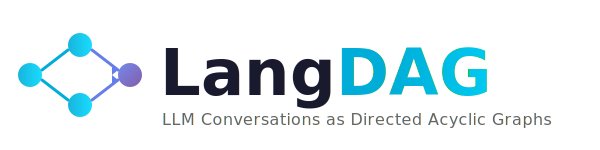

<p align="center">
  
</p>

<h3 align="center"><em>LLM Conversations as Directed Acyclic Graphs</em></h3>

<p align="center">
  <a href="https://github.com/aduermael/langdag/actions/workflows/test-go.yml"></a>
  <a href="https://github.com/aduermael/langdag/actions/workflows/test-python.yml"></a>
  <a href="https://github.com/aduermael/langdag/actions/workflows/test-typescript.yml"></a>
  <a href="https://github.com/aduermael/langdag/actions/workflows/test.yml"></a>
  <a href="https://github.com/aduermael/langdag/tags"></a>
  <a href="LICENSE"></a>
  <a href="https://golang.org/"></a>
</p>

<p align="center">
  <a href="#features">Features</a> •
  <a href="#use-as-a-go-library">Go Library</a> •
  <a href="#installation">Installation</a> •
  <a href="#cli">CLI</a> •
  <a href="#api--sdks">API & SDKs</a> •
  <a href="#roadmap">Roadmap</a>
</p>

---

## Why LangDAG?

LangDAG is a **high-performance Go tool** that persists LLM conversations as directed acyclic graphs. Branch from any point, explore alternative paths, and maintain full conversation history.

```
┌─────────┐     ┌─────────┐     ┌─────────┐     ┌─────────┐
│  User   │────▶│   LLM   │────▶│  Tool   │────▶│   LLM   │
└─────────┘     └─────────┘     └─────────┘     └─────────┘
                    │                               │
                    └──────── conversation ─────────┘
                                 = DAG
```

**Key insight:** A conversation *is* a DAG—it just grows incrementally.

---

## Features

| Feature | Description |
|---------|-------------|
| ⚡ **Performance** | Pure Go, ~1ms overhead, single static binary, zero runtime deps |
| 🌊 **Native Streaming** | SSE streaming with real-time token delivery |
| 🌳 **Conversation Forking** | Branch from any node, explore alternative paths |
| 🏷️ **Node Aliases** | Human-readable names for any node |
| 🔄 **Auto Retry** | Exponential backoff for transient LLM failures |
| 💾 **Persistent Storage** | SQLite with WAL mode, full history replay |
| 🔧 **Tool Use** | First-class tool definitions with tool_use/tool_result flows |
| 🌐 **Multi-Provider** | Canonical model routing across Anthropic, OpenAI, Gemini, Grok, OpenRouter, Ollama, Azure, Vertex AI, and Bedrock deployments |

---

## Use as a Go Library

LangDAG is available as an importable Go package for building AI agent applications with persistent conversation storage.

```bash
go get langdag.com/langdag
```

### Basic Usage

```go
import "langdag.com/langdag"

client, err := langdag.New(langdag.Config{
    StoragePath: "./agent.db",
    APIKeys: map[string]string{
        "anthropic": os.Getenv("ANTHROPIC_API_KEY"),
    },
})
if err != nil {
    log.Fatal(err)
}
defer client.Close()

// Start a new conversation
result, err := client.Prompt(ctx, "What is LangDAG?",
    langdag.WithModel("claude-opus-4-6"),
)
// Stream the response
for chunk := range result.Stream {
    if chunk.Done {
        fmt.Printf("\n[saved as node %s]\n", chunk.NodeID)
    } else {
        fmt.Print(chunk.Content)
    }
}

// Continue the conversation from a specific node
result2, err := client.PromptFrom(ctx, result.NodeID, "Tell me more")
```

### Deployment-Aware Routing

```go
client, err := langdag.New(langdag.Config{
    Deployments: map[string]langdag.DeploymentConfig{
        "openai-direct": {APIKey: os.Getenv("OPENAI_API_KEY")},
        "openrouter":    {APIKey: os.Getenv("OPENROUTER_API_KEY")},
    },
    RoutingPolicy: &langdag.RoutingPolicy{
        Providers: map[string][]langdag.RoutingStage{
            "openai": {{
                Deployments: []langdag.DeploymentChoice{
                    {DeploymentID: "openai-direct", Weight: 80},
                    {DeploymentID: "openrouter", Weight: 20},
                },
                Retries: 1,
            }},
        },
    },
})

result, err := client.Prompt(ctx, "Review this change",
    langdag.WithModel("openai/gpt-4.1-2025-04-14"),
)
```

The request targets a canonical model ID. LangDAG resolves it to an eligible
deployment offering, passes the deployment's native model ID to the adapter, and
records served identity, normalized usage, pricing snapshot, and provider exact
cost metadata when available.
Provider and model routing rules are scoped, so unrelated models continue to
use automatic eligible deployment resolution. Set `RoutingPolicy.Default` only
when you intentionally want an advanced global baseline for every unmatched
model.

### Config Options

| Field | Description |
|-------|-------------|
| `StoragePath` | Path to SQLite database file |
| `APIKeys` | Map of provider name to API key (`"anthropic"`, `"openai"`, `"gemini"`, `"grok"`) |
| `Provider` | Default provider name (anthropic, openai, gemini, grok) |
| `ModelCatalog` | Deployment-aware catalog used for canonical model resolution |
| `Deployments` | Routeable deployment credentials, base URLs, cloud settings, and Azure model mappings |
| `RoutingPolicy` | Weighted deployment stages by default, provider, or exact canonical model |
| `Routing` | Deprecated provider-keyed routing rules |
| `FallbackOrder` | Deprecated provider fallback order |
| `RetryConfig` | Retry settings (max retries, base/max delay) |

### Available Methods

- `client.Prompt(ctx, message, opts...)` — Start a new conversation
- `client.PromptFrom(ctx, nodeID, message, opts...)` — Continue from an existing node
- `client.ListConversations(ctx)` — List all root conversation nodes
- `client.GetNode(ctx, nodeID)` — Get a single node by ID
- `client.GetSubtree(ctx, nodeID)` — Get full subtree rooted at a node
- `client.GetAncestors(ctx, nodeID)` — Get ancestor chain up to root
- `client.DeleteNode(ctx, nodeID)` — Delete a node and its subtree

### Testing with `NewWithDeps`

Use `NewWithDeps` to inject custom storage and provider implementations — no API keys required in tests:

```go
client := langdag.NewWithDeps(tempStorage, mockProvider)
```

## Model Catalog Refresh

LangDAG ships an embedded catalog and can refresh a cache from
`https://langdag.com/model-catalog/v1/catalog.json`. Prompt/runtime routing
prefers the default user cache populated by `langdag models --update`, then
falls back to the embedded catalog. Refresh calls are enabled by default and can
be controlled with `LANGDAG_MODEL_CATALOG_REFRESH`,
`LANGDAG_MODEL_CATALOG_URL`, and `LANGDAG_MODEL_CATALOG_TIMEOUT`. Invalid,
stale, or partially generated remote catalogs are rejected before cache
replacement.

---

## Installation

### From Source

```bash
git clone https://github.com/aduermael/langdag.git
cd langdag
go build -o langdag ./cmd/langdag
```

### Go Install

```bash
go install github.com/aduermael/langdag/cmd/langdag@latest
```

---

## CLI

```bash
# Set your API key
export ANTHROPIC_API_KEY="your-api-key"

# Start a new conversation
langdag prompt "What is a DAG?"

# Interactive mode
langdag prompt

# List all conversations (root nodes)
langdag ls

# View a conversation tree
langdag show a1b2

# Continue from a specific node
langdag prompt a1b2 "Tell me more"

# Delete a conversation
langdag rm a1b2
```

Every conversation is a DAG that grows as you chat—and you can branch from any point:

```
Node history:
├─ 1a2b [human]: What is a DAG?
│  ├─ 5e6f [assistant]: A DAG is a directed graph with no cycles...
│  │  └─ 9c0d [human]: Can you give me an example?
│  │     └─ 2f34 [assistant]: Sure! Think of a family tree...
│  └─ 7a8b [assistant]: Let me explain with a diagram...
│     └─ 4e5f [human]: That's clearer, thanks!
└─ ...
```

<details>
<summary><strong>CLI Reference</strong></summary>

```bash
# Prompt commands
langdag prompt "message"               # Start new conversation
langdag prompt -m <model> "message"    # Use a specific model
langdag prompt -s "system" "message"   # With system prompt
langdag prompt <node-id> "message"     # Continue from node
langdag prompt                         # Interactive mode (new tree)
langdag prompt <node-id>               # Interactive mode from node

# Node management
langdag ls                             # List root nodes
langdag show <id>                      # Show node tree
langdag rm <id>                        # Delete node and subtree
```

</details>

---

## API & SDKs

LangDAG can run as a REST API server:

```bash
langdag serve --port 8080
```

**Endpoints:**
- `POST /prompt` — Start new conversation tree
- `POST /nodes/{id}/prompt` — Continue from existing node
- `GET /nodes` — List root nodes
- `GET /nodes/{id}` — Get a single node
- `GET /nodes/{id}/tree` — Get full tree from node
- `DELETE /nodes/{id}` — Delete node and subtree
- `PUT /nodes/{id}/aliases/{alias}` — Create node alias
- `GET /nodes/{id}/aliases` — List node aliases
- `DELETE /aliases/{alias}` — Delete alias

See the [OpenAPI specification](api/openapi.yaml) for full API documentation.

### Python

```bash
pip install langdag
```

```python
from langdag import LangDAGClient

client = LangDAGClient()

# Start a conversation
node = client.prompt("What is a DAG?")
print(node.content)

# Continue from any node
node2 = node.prompt("Tell me more")

# Stream responses
for event in client.prompt("Explain graphs", stream=True):
    if event.content:
        print(event.content, end="")
```

### Go

```bash
go get github.com/langdag/langdag-go
```

```go
client := langdag.NewClient("http://localhost:8080")

// Start a conversation
node, _ := client.Prompt(ctx, "What is a DAG?")
fmt.Println(node.Content)

// Continue from any node
node2, _ := node.Prompt(ctx, "Tell me more")

// Stream responses
stream, _ := client.PromptStream(ctx, "Explain graphs")
for event := range stream.Events() {
    fmt.Print(event.Content)
}
result, _ := stream.Node()
```

### TypeScript

```bash
npm install langdag
```

```typescript
import { LangDAGClient } from 'langdag';

const client = new LangDAGClient();

// Start a conversation
const node = await client.prompt('What is a DAG?');
console.log(node.content);

// Continue from any node
const node2 = await node.prompt('Tell me more');

// Stream responses
const stream = await client.promptStream('Explain graphs');
for await (const event of stream.events()) {
  process.stdout.write(event.content);
}
const result = await stream.node();
```

See the [SDK source code](sdks/) and [example projects](examples/) for more details.

---

## Architecture

```
┌──────────────────────────────────────────────────────────┐
│                      CLI / API                           │
├──────────────────────────────────────────────────────────┤
│                 Conversation Manager                     │
├──────────────────────────────────────────────────────────┤
│                      Provider Layer                      │
│   ┌───────────┐  ┌───────────┐  ┌───────────┐  ┌──────┐ │
│   │ Anthropic │  │  OpenAI   │  │  Gemini   │  │ Grok │ │
│   └───────────┘  └───────────┘  └───────────┘  └──────┘ │
├──────────────────────────────────────────────────────────┤
│                   Storage Layer                          │
│   ┌───────────┐                                          │
│   │  SQLite   │                                          │
│   └───────────┘                                          │
└──────────────────────────────────────────────────────────┘
```

---

## Documentation

- **[Design Document](docs/DESIGN.md)** — Deep dive into architecture
- **[API Reference](https://aduermael.github.io/langdag/api)** — REST & WebSocket APIs
- **[Examples](examples/)** — Sample workflows
- **[Migrate from LangGraph](docs/migrate-from-langgraph.md)** — Import your existing LangGraph conversations into LangDAG

---

## Roadmap

- [x] SQLite storage with WAL mode
- [x] Anthropic, OpenAI, Gemini providers with streaming
- [x] Node-centric API (prompt, branch, tree)
- [x] Tree visualization
- [x] REST API with SSE streaming
- [x] Python, Go, TypeScript SDKs
- [x] Node aliases
- [x] Automatic retry with exponential backoff
- [x] Tool use (WithTools, tool_use/tool_result flows)
- [x] Grok (xAI) provider
- [x] Model catalog with pricing and context windows
- [x] LangGraph migration tooling (JSON + SQLite import)
- [x] Prompt caching (Anthropic)
- [ ] Web UI

---

## Comparison

| | LangDAG | LangGraph | Langfuse |
|---|---------|-----------|----------|
| **Focus** | Conversation tree store | State machine orchestration | Observability |
| **Language** | Go | Python | TypeScript |
| **Performance** | ~1ms overhead | Higher latency | N/A |
| **Conversation model** | Native DAG | Manual | Trace-based |
| **Deployment** | Single binary | Python runtime | SaaS/Self-host |

---

## Contributing

Contributions are welcome! Please read the [Contributing Guide](CONTRIBUTING.md) first.

```bash
# Run tests
go test ./...

# Build
go build -o langdag ./cmd/langdag
```

---

## License

MIT License - see [LICENSE](LICENSE) for details.

---

<p align="center">
  <sub>Built with ❤️ in Go</sub>
</p>
